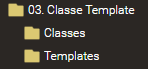
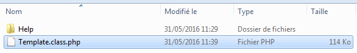
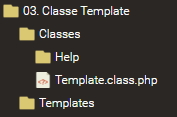
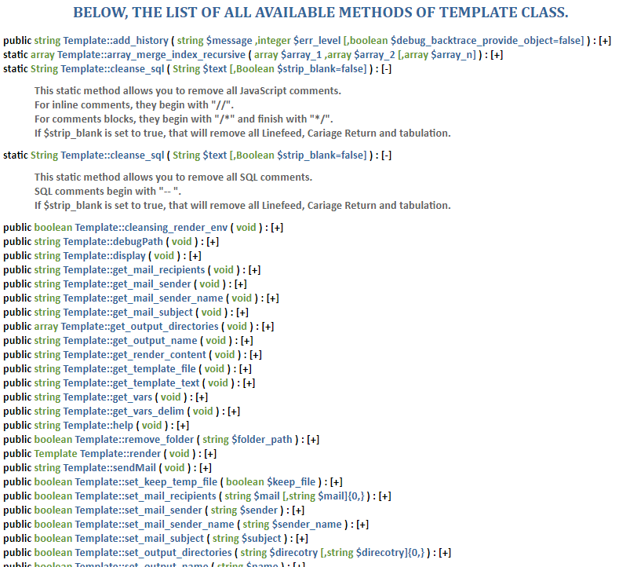

# PHP Template Class

Grâce à la séparation du fond de la forme, maintenir des scripts devient un jeu d'enfant


## Status

[](https://travis-ci.org/neooblaster/Template)
[](https://styleci.io/repos/78587660)

[](https://codecov.io/github/neooblaster/Template?branch=master)
[](https://codeclimate.com/github/neooblaster/Template)


## Summary

[](BeginSummary)
* [Status](#status)
* [Summary](#summary)
* [Manuel](#manuel)
    * [Principe de fonctionnement](#principe-de-fonctionnement)
    * [Débuter avc la classe PHP ``Template``](#d%c3%a9buter-avc-la-classe-php-template)
        * [Position du contexte](#position-du-contexte)
        * [Installer la classe ``Template``](#installer-la-classe-template)
        * [Faire un modèle HTML](#faire-un-mod%c3%a8le-html)
    * [Règles de rédaction d'un modèle](#r%c3%a8gles-de-r%c3%a9daction-dun-mod%c3%a8le)
        * [Les variables](#les-variables)
        * [Les blocs ``répétables``](#les-blocs-r%c3%a9p%c3%a9tables)
        * [Les blocs ``imbriqués``](#les-blocs-imbriqu%c3%a9s)
        * [Les blocs ``conditionnels``](#les-blocs-conditionnels)
        * [Les blocs de code ``PHP``](#les-blocs-de-code-php)
        * [La déclaration de blocs](#la-d%c3%a9claration-de-blocs)
        * [Invocation de blocs](#invocation-de-blocs)
        * [Les blocs ``récursif``](#les-blocs-r%c3%a9cursif)
        * [Les inclusions de modèles](#les-inclusions-de-mod%c3%a8les)
        * [Atteindre les variables simples depuis un bloc ``répétable``](#atteindre-les-variables-simples-depuis-un-bloc-r%c3%a9p%c3%a9table)
        * [Modifier le code de composition d'une instruction.](#modifier-le-code-de-composition-dune-instruction)
    * [Utilisation de la classe ``Template``](#utilisation-de-la-classe-template)
        * [Phase 1 - Initialisation du moteur](#phase-1-initialisation-du-moteur)
        * [Phase 2 - Configuration du moteur](#phase-2-configuration-du-moteur)
        * [Phase 3 - Exécution du moteur](#phase-3-ex%c3%a9cution-du-moteur)
    * [Arranger ses données pour les envoyer dans le moteur](#arranger-ses-donn%c3%a9es-pour-les-envoyer-dans-le-moteur)
        * [Compilation et transmission des donénes aux variables qualifiées de ``simples`` ou `globales`](#compilation-et-transmission-des-don%c3%a9nes-aux-variables-qualifi%c3%a9es-de-simples-ou-globales)
            * [Définition du modèle ``var_simple.tpl``](#d%c3%a9finition-du-mod%c3%a8le-var_simpletpl)
            * [Scripts de calcul et d'exécution](#scripts-de-calcul-et-dex%c3%a9cution)
            * [Résultat du rendu](#r%c3%a9sultat-du-rendu)
        * [Compilation et transmission des données cloisonnées pour les blocs ``répétables``](#compilation-et-transmission-des-donn%c3%a9es-cloisonn%c3%a9es-pour-les-blocs-r%c3%a9p%c3%a9tables)
            * [Définition du modèle ``var_bloc.tpl``](#d%c3%a9finition-du-mod%c3%a8le-var_bloctpl)
            * [Scripts de calcul et d'exécution](#scripts-de-calcul-et-dex%c3%a9cution)
            * [Résultat du rendu](#r%c3%a9sultat-du-rendu)
        * [Compilation et transmission des données pour des blocs ``répétables imbriqués``](#compilation-et-transmission-des-donn%c3%a9es-pour-des-blocs-r%c3%a9p%c3%a9tables-imbriqu%c3%a9s)
            * [Définition du modèle `var_bloc_i.tpl`](#d%c3%a9finition-du-mod%c3%a8le-var_bloc_itpl)
            * [Scripts de calcul et d'exécution](#scripts-de-calcul-et-dex%c3%a9cution)
            * [Résultat du rendu](#r%c3%a9sultat-du-rendu)
    * [Méthodes de traitements UTF-8 embarquées](#m%c3%a9thodes-de-traitements-utf-8-embarqu%c3%a9es)
    * [Maintenance des données](#maintenance-des-donn%c3%a9es)
        * [Mise à jour de donnés](#mise-%c3%a0-jour-de-donn%c3%a9s)
        * [Switcher les booleans](#switcher-les-booleans)
        * [Retirer des donnés](#retirer-des-donn%c3%a9s)
    * [Manuel embarqué de la classe ``Template``](#manuel-embarqu%c3%a9-de-la-classe-template)
    * [Annexes](#annexes)
        * [La méthode ``debugPath``](#la-m%c3%a9thode-debugpath)
        * [La méthode ``get_render_content``](#la-m%c3%a9thode-get_render_content)
        * [La méthode ``set_keep_temp_file``](#la-m%c3%a9thode-set_keep_temp_file)
        * [La méthode ``set_render_type``](#la-m%c3%a9thode-set_render_type)
        * [La méthode ``set_temporary_repository``](#la-m%c3%a9thode-set_temporary_repository)
        * [La méthode ``show_warnings``](#la-m%c3%a9thode-show_warnings)
        * [La méthode ``remove_folder``](#la-m%c3%a9thode-remove_folder)
        * [La méthode statique ``strip_blank``](#la-m%c3%a9thode-statique-strip_blank)
        * [La méthode statique ``cleanse_js``](#la-m%c3%a9thode-statique-cleanse_js)
        * [La méthode statique ``cleanse_sql``](#la-m%c3%a9thode-statique-cleanse_sql)
    * [En résumé](#en-r%c3%a9sum%c3%a9)
[](EndSummary)


## Manuel

**English :** Firstly, this manual is written in french to simplify and save time to migrate the 
documentation.

**Français :** Dans un premier, ce manuel est rédigé en français pour simplifier et gagner du temps 
pour migrer la documentation


### Principe de fonctionnement

Selon l'application que l'on souhaite réaliser, l'utilisation d'un modèle peut suffire.
Par exemple, si l'on veut envoyer un courrier électronique à plusieurs personnes,
seules les informations relatives à la personne changent, alors que le reste est figé.
Le modèle contient donc le courrier avec des variables auxquelles on assigne des valeurs.

En développement, les modèles permettent également de séparer le fond de la forme.
De cette manière, on mélange moins les langages de développement et les codes sources sont ainsi plus clairs.
Cela est d'autant plus vrai quand il s'agit d'un projet qui atteint un certain niveau de complexité
tel qu'une application.

Pour assembler le fond et la forme en un document finalisé,
il faut un moteur qui va effectuer toutes les opérations requises.
Ce moteur est défini par la classe ``Template`` que j'ai développé en me basant sur un tutoriel
d'utilisation de la classe du même nom fournis par **PHPLIB**.

Au cours de ce manuel, les différentes notions et fonctionnalités de la classe ``Template`` seront introduites
au fur et à mesure pour une montée en compétence progressive.


### Débuter avc la classe PHP ``Template``

Comme annoncé, le but de la séparation du fond de la forme est de soigner ses programmes qui,
par conséquent, seront plus facile à maintenir dans le temps.
Combiné avec une classe PHP dont le rôle est d'offrir des fonctionnalités avancées à l'aide de simple méthodes,
il est très facile de développer des applications de grande envergure.

Etant donnée que nous allons séparer le fond de la forme, autrement dit,
le donnée d'un côté et la structure d'affichage de l'autre, nous allons travailler sur deux fichiers distinct.
D'abord nous allons concevoir le fichier HTML qui composera la forme et ensuite nous établirons le script **PHP**
qui d'une part calcul les données et d'autre part qui executera la classe pour composer le document final.


#### Position du contexte

Dans ce manuel nous allons travailler à l'aide de fichiers HTML,
mais il est tout à fait possible de composer d'autre fichiers.
Ce qui compte c'est que le document soit lisible à la facon d'un simple fichier texte (non encrypté).
C'est la syntaxe au sein du fichier qui déterminera si celui-ci est valide ou non.
Dans l'exemple de l'HTML, si les balises sont valides, le document fonctionnera parfaitement.
Voici quelques exemples de documents que vous pourriez avoir besoin de composer.

Au fur et à mesure des explications, je vais construire un semblant d'application.
Elle ne sera ni dynamique, ni interactive, mais je metterais en avant les besoins et la
facon d'y répondre à l'aide de la classe ``Template``.


* Page **HTML**
* Feuille de style **CSS**
* Du contenu **JavaScript**
* Structure de donnée **JSON**
* Structure de donnée **XML**
* Structure de donnée **INI**
* Document de **texte**

Toujours dans la mise en oeuvre du contexte, nous allons ensemble établir l'environnement de travail,
car il est essentiel de bien visualiser les chemins vers les fichiers qui seront créer et celà permettera
également de mettre en avant ma méthode de travail.

Alors à partir d'un dossier, je vais d'abord créer un dossier ``Classes`` dans lequel je viendrais déposer
le fichier **PHP** contenant la classe ``Template`` ainsi que les autres classes existantes.
Ensuite, je vais créer un dossier ``Templates`` dans lequel nous trouverons l'ensemble des fichiers de modèles.
Nous obtenons à ce stade la structure de dossier suivante.



````
┌ 03. Classe Template/
└─┬ Classes/
  └ Templates/
````


#### Installer la classe ``Template``

Dans notre exemple nous partons de zéro. Nous devons donc obtenir et installer la classe avant de l'utiliser.

Sur l'ensemble des fichiers présent dans le projet, seul les fichiers du dossier ``src`` sont nécessaire.

Le système se compose du fichier principale ```Template.class.php```.
Le dossier ``Help`` constitue pour le moteur, le manuel interne.
En l'absence de ces fichiers, l'utilisation de la méthode ``help()`` échouera et émettra une notification.



Nous allons copier l'ensemble des fichiers ci-dessus dans le dossier Classes créé précédemment.



A ce stade la classe est maintenant installée et utilisable.
En résumé, il ne s'agit que d'un simple copier-coller.


#### Faire un modèle HTML

Avant d'aborder le partie script, je souhaite d'abord établir un tout premier modèle HTML qui permettra au passage
de présenter ma méthode de fonctionnement.
Je vais venir déposer mon fichier dans le dossier ``Templates`` prévus à cet effet.
Mon premier modèle s'intitulera ``fichier_prisonnier.tpl.html``.
Concernant la nomenclature de mes fichiers, j'ai choisis d'une part qu'il contienne l'extension ``.tpl``
indiquant le rôle du fichier, ainsi que l'extension finale ``.html`` qui permet ainsi aux logiciels d'utiliser
la colorisation syntaxique qui convient.
Rien n'empêche de créer un ensemble d'extension comme par exemple ``.tpl-html`` et de venir configurer votre logiciel
préféré pour reconnaitre cette extension. Dans ma méthode, c'est standart et ne requiet donc aucune
configuration supplémentaire.

Notre premier modèle sera l'exmplaire de réalisation d'une fiche d'identité de sécurité d'un prisonnier.
Nous irons à l'essentiel afin de ne pas surchargé de ligne de code inutile.

_**``Fichier fiche_prisonnier.tpl.html :``**_
```html
<h1>Fiche Prisonnier N° 31052016-1112</h1>

<h3>Identité</h3>
<ul>
	<li>Nom : TOUNET</li>
	<li>Prénom : George</li>
	<li>Age : 34 ans.</li>
	<li>Taille : 171 cm.</li>
</ul>

<h3>Délis et Crimes</h3>
<h4>Crimes</h4>
<ul>
	<li>Aucun</li>
</ul>
<h4>Délis</h4>
<ul>
	<li>Aucun</li>
</ul>
```


### Règles de rédaction d'un modèle

[](TODO EXTEND)
[](TODO EXTEND WITH)

Un modèle n'est qu'un simple fichier texte qui comporte des variables. Le format du fichier importe peu.
Si vous voulez rendre un document **XML**, vous pouvez faire un modèle au format **XML**.
Ce qui importe, c'est le respect de la syntaxe au sein du fichier.
Il existe une extension dédié au modèle qui est ``.tpl``, acronyme de **template**.

En plus de l'extension ``.tpl``, je vous conseille d'y ajouter à la suite l'extension réelle du fichier.
De cette facon votre éditeur de texte pourra gérer la colorisation syntaxique.
Ainsi il sera plus aisé de travailler sur le modèle.
Par exemple, pour un modèle qui a terme sera une page **HTML**, je vais nommer mon modèle ``page.tpl.html``.

Ce qui rend votre document généré valide, n'est dû qu'à son contenu et le respect de la syntaxe de son langage.
L'extension n'est utile que pour Windows afin d'associer le logiciel correspondant à ce type de fichier.
Par habitude, on définit l'extension dans le fichier de sortie.
Tout cela est configuré avant le rendu du document et sera présenté dans le chapitre dédié à la
configuration du moteur.

Bien qu'un modèle ne soit qu'une structure pré-établie,
parfois il est nécessaire d'avoir du contenu qui sache s'adapter.
Pour cela, il existe plusieurs instructions permettant de faire des codes propres et organisés.
Disons qu'il faut utiliser les outils à bon escient.


#### Les variables

Dans mon moteur de ``Template``, vous êtes libre de choisir ce qui caractérise une variable
à la seule condition que le **symbole choisi encadre la variable**.
Pour être plus précis, le ou les caractères choisit en guise de symbôle doivent se trouver
d'une part devant la variable et d'autre part après la variable, dans l'ordre inverse à la facon
des balises en **HTML** ou **XML**.
Il est courant de voir comme symbole de variable le caractère ``pourcentage`` (``%``).
Cette notation est, par exemple, utilisée pour définir les variables d'environnement Windows.
Voici la liste des caractères autorisés comme délimiteurs de variables.

* **Caractères alphabétique :** [a-zA-Z]
* **Caractères numérique :** [0-9]
* **Caractères spéciaux ci-indiqué uniquement :**
    * **Le pourcentage :** ``%``
    * **L'arobase :** ``@``
    * **"é" Commercial :** ``&``
    * **Le "simple" quote :**   ``'``
    * **Le "double" quote :** ``"``
    * **Trait d'union :** ``-``
    * **L'underscore :** ``_``
    * **Le points :** ``.``
* **Caractères "symétriques" :** S'auto-complète pour la balise fermante
    * **Parenthèse :** ``(`` et ``)``
    * **Crochet :** ``[`` et ``]``
    * **Accolade :** ``{`` et ``}``
    
Cette liste est également valable pour les noms de variables bien qu'en général,
seul les caractères alpha-numérique suffisent.

Aussi, voici la liste des caractères strictement interdit en tant que délimiteurs et noms de variables.
S'ils sont utilisés, il s'en suivra une erreur de compilation.
Au mieux, les variables ne seront pas évaluées.

* **Le dollars :** ``$``
* **Le joker :** ``*``
* **Le plus :** ``+``
* **Le dièse :** ``#``

**Remarque n°1 :** le moteur est sensible à la casse.
C'est-à-dire qu'il distinguera la variable ``%VARIABLE%`` de ``%variable%``.

**Remarque n°2 :** il **NE FAUT SURTOUT** pas utiliser le délimiteur choisi dans le nom de variable.

Voici un exemple de variables valides :

```
Une première ligne comportant une %VARIABLE% valide.
Un seconde ligne avec une autre %variable% valide.
L'ensemble des %variables% du modèle doivent être délimitées avec le même symbôle.
Exemple de délimiteur accepté : %VAR%, @VAR@, $VAR$, _VAR_, -VAR-
Les {ACCOLADES}, les (PARENTHESES) et les [CROCHETS] sont pris en charge.
Ces exemple là sont aussi valables : {{VARIABLE}}, {[VARIABLE]} et {AZ_VARIABLES_ZA}
```

Voici un exemple de variables invalides :

```
Cette %VARIABLE est fausse, car ne dispose que d'un seul symbôle.Le tout est vu comme du simple texte.
Cette %VARIABLE@ est fausse, car ne respecte pas l'ordre inverse du délimiteur. Le tout est vu comme du simple texte.
Cette {VARIABLE{ est fausse, car ne respecte pas l'ordre inverse du délimiteur. Le tout est vu comme du simple texte.
Cette VARIABLE n'en est pas une, car ne dispose d'aucun délimiteur !
```

Pour nommer les variables, je trouve qu'il est intéressant de les écrire en majuscule.
De cette façon elles ressortent mieux dans le document.
C'est d'autant plus intéressant que les logiciels qui disposent de la colorisation syntaxique
ne les voient pas comme variable.
Pour les variables, on ne pouvait vraiment pas faire plus simple !
Voyons comment ça fonctionne pour les blocs.


#### Les blocs ``répétables``

Pour commencer, qu'est-ce qu'un bloc répétable ?
Un bloc représente un ensemble de lignes qui doivent être reproduites un certain nombre de fois
et ce, de manière indéterminée.
Par exemple, vous voulez écrire une liste de couple "nom - prénom".
Si on connait précisément le nombre de couple "nom - prénom",
on peut l'écrire dans le modèle sous cette forme :

```html
<ul>
  <li>%NOM_1% - %PRENOM_1%</li>
  <li>%NOM_2% - %PRENOM_2%</li>
</ul>
```

Jusque-là, ça va. Maintenant s'il fallait le faire pour 10 couples "nom - prénom" et plus,
cela risque de devenir rapidement long à écrire. De plus, pour le passage des données,
cela ne sera que plus fastidieux. C'est là qu'intervienne les blocs.

Un peu comme les variables, les blocs sont délimités, non pas par un caractère, mais par des balises.
Le tout compose une instructions.

Voici les balises d'ouverture et de fermeture d'un bloc.

```html
<!-- BEGIN_BLOCK NOM_DU_BLOC -->
<!-- END_BLOCK NOM_DU_BLOC -->
```

Comme vous pouvez le remarquer l'instruction est composée des mots clef ``BEGIN`` ou ``END`` en plus du mot ``_BLOCK``
qui sont significatifs. A la suite de ces indicateurs, on trouve le nom du bloc.
Les caractères autorisés sont les mêmes que les noms des variables à l'**exception de l'espace**
qui lui est strictement interdit.
Attention, les noms des blocs ne sont pas des variables et ne sont donc pas délimités.
Il est impératif qu'il n'y ait aucun caractère avant et après l'instruction dans la ligne du ficher.
Si c'est le cas, les données adjacentes ne seront pas retranscrites.

Si on reprend l'exemple des couples "nom - prénom", nous obtenons :

```html
<!-- BEGIN_BLOCK NOM_DU_BLOC -->
	<li>%NOM% - %PRENOM%</li>
<!-- END_BLOCK NOM_DU_BLOC -->
```

Attention, les variables à l'intérieur des blocs sont toujours délimitées par le symbôle que vous aurez défini.
Notez que les variables spécifiées sont cloisonnées à ce bloc.
La transmission de données pour les blocs sera expliquée dans le chapitre dédié.


#### Les blocs ``imbriqués``

Il peut arriver qu'on ait besoin de répéter une partie de code dans un bloc qui, lui-même sera répété.
Exemple, vous faites des fiches utilisateurs dont vous ignorez le nombre.
Dans ces fiches, vous voulez lister les différents métiers que l’utilisateur a exercés.
Le nombre de métier dépend directement de l’utilisateur. Pour couvrir cette situation,
il suffit d'insérer un nouveau bloc. Celui-ci se trouvera lui-même dans un bloc.
Nous venons de faire une imbrication de bloc. Voici un exemple pour visualiser mes propos.

```
<!-- BEGIN_BLOCK FICHE_UTILISATEUR -->
<div>
  <h1>Fiche de %USR_PRENOM% %USR_NOM%</h1>
	
  <ul>
	<li>Age : %USR_AGE% ans.</li>
	<li>Taile : %USR_TAILLE% cm.</li>
	...
  </ul>
	
  <h2>Métier(s) exercé(s) : </h2>
	
  <ul>
	<!-- BEGIN_BLOCK USR_METIER -->
	<li>%METIER%</li>
	<!-- END_BLOCK USR_METIER -->
  </ul>
</div>
<!-- END_BLOCK FICHE_UTILISATEUR -->
```

Les règles de nommage pour les blocs imbriqués ne changent pas.
Ce qui est important, c'est qu'un bloc dispose d'un nom unique.
Il ne doit absolument pas avoir deux blocs identifiés par le même nom.
Si c'est le cas, le moteur retournera une erreur fatale.
Le passage d'informations pour les blocs imbriqués sera expliqué dans le chapitre dédié.


#### Les blocs ``conditionnels``

Il existe un autre type de bloc, c'est le **bloc conditionnel**.
A la différence des blocs répétables, celui-ci s'affiche si la, ou, les conditions sont remplies.
Il ne se répète pas, mais il peut très bien être inclus dans un bloc normal.
Voici comment déclarer un **bloc conditionnel** :

```html
<!-- IF (%CONDITIONS%) AS NOM_TEST_CONDITIONNEL -->
L'utilisateur fait partie du groupe "Admin", il à donc les droits d'accéder à ce contenu :
(...)
<!-- ENDIF NOM_TEST_CONDITIONNEL -->
```
La balise de déclaration du **bloc conditionnel** gère les variables et sont remplacées
avant d'effectuer le test à proprement parler.

Admettons qu'à la place de ``%CONDITIONS%``, j'ai mis ``true``, le contenu du bloc serait donc affiché.
De la même manière, si j'avais mis ``false``, alors le contenu aurait été ignoré.

Voici quelques exemples de tests conditionnels que l'on peut trouver

```html
Si ALLOWED = true;
	
<!-- IF (%ALLOWED%) AS NOM_TEST_CONDITIONNEL --> alors le contenu est affiché
<!-- IF (!%ALLOWED%) AS NOM_TEST_CONDITIONNEL --> alors le contenu est ignoré
	
Si ALLOWED = false;
	
<!-- IF (%ALLOWED%) AS NOM_TEST_CONDITIONNEL --> alors le contenu est ignoré
<!-- IF (!%ALLOWED%) AS NOM_TEST_CONDITIONNEL --> alors le contenu est affiché
	
Si LEVEL = 1
	
<!-- IF (%LEVEL% > 0) AS NOM_TEST_CONDITIONNEL --> alors le contenu est affiché
<!-- IF (%LEVEL% < 0) AS NOM_TEST_CONDITIONNEL --> alors le contenu est ignoré
	
Si LEVEL = -1
	
<!-- IF (%LEVEL% > 0) AS NOM_TEST_CONDITIONNEL --> alors le contenu est ignoré
<!-- IF (%LEVEL% < 0) AS NOM_TEST_CONDITIONNEL --> alors le contenu est affiché

Si ALLOWED = TRUE
Si LEVEL = 1

<!-- IF (%ALLOWED% AND (%LEVEL% > 0)) AS NOM_TEST_CONDITIONNEL --> alors le contenu est affiché

Si ALLOWED = TRUE
Si LEVEL = -1

<!-- IF (%ALLOWED% AND (%LEVEL% > 0)) AS NOM_TEST_CONDITIONNEL --> alors le contenu est ignoré

Si ALLOWED = FALSE
Si LEVEL = 1

<!-- IF (%ALLOWED% AND (%LEVEL% > 0)) AS NOM_TEST_CONDITIONNEL --> alors le contenu est ignoré
```

Tout comme les vrais langages, vous pouvez définir des cas alternatifs si la ou les conditions ne sont pas remplies.
Je parle des cas ``else if`` et ``else``.

Le moteur gère également cette structure conditionnelle.
Ci-dessous, un exemple complet pour vous présenter la syntaxe à adopter

````html
<!-- IF (%AGE% < 18) AS CATEGORIE_AGE -->
Catégorie : Mineur
<!-- ELSEIF (%AGE% >= 18 AND %AGE% < 50) -->
Catégorie : Adulte
<!-- ELSEIF (%AGE% >= 50 AND %AGE% < 110) -->
Catégorie : Senior
<!-- ELSE -->
Catégorie : Immortel
<!-- ENDIF CATEGORIE_AGE -->
````

L'imbrication est également possible entre blocs conditionnels ainsi qu'entre blocs conditionnels et répétables.

Notez que vous pouvez et devrez utiliser les variables dans le champs dédié à aux conditions.
L'évaluation de ou des variables dépendrons de l'endroit où se trouve le bloc conditionnel.

Avec cet aspect, on commence à s'éloigner du concept de modèle pur,
mais cela vous évite de devoir faire autant de modèles qu'il y aurait de possibilités.


#### Les blocs de code ``PHP``

Bien que cela aille à l'encontre du principe du modèle, il y a des cas où l'utilisation du **PHP** est inévitable.

Pour utiliser le **PHP**, au lieu d'utiliser les balises traditionnelles <?php et ?>,
j'ai introduit une instruction dédiée qui est la suivante :

````html
<!-- BEGIN_PHP NOM_BLOC_PHP -->
<!-- END_PHP NOM_BLOC_PHP -->
````

Entre ces deux balises, la **syntaxe PHP reste la même**.
C'est-à-dire qu'il ne faut pas oublier le point-virgule (``;`) à la fin de chaque instruction.

Le plus est que vous pouvez introduire des variables du moteur ``Template`` au sein du code PHP écrit.
Celui-ci est d'abord transcrit en tant que modèle avant d'être évalué en tant que code PHP.

Pour que le code PHP au sein du modèle puisse communiquer avec votre script,
la classe ``Template`` met à disposition une variable pseudo-superglobale qui est ``$_PHP``.
En effet, celle-ci permet de jongler entre le script et le modèle,
mais ne perdure pas à la manière de ``$_SESSION``.
Elle est plus un pont entre le script et le moteur, mais ça peut être utile.

Pour schématiser l'ensemble des propos, voici un petit exemple d'utilisation:

````php
<select>
<!-- BEGIN_PHP DAY_NUMBER -->

	$_PHP['DAY_LANG'] = 'jour'; // Donnée passé du côté du script, mais ici pour la démo

	for($i = 1; $i < 32; $i++){
		$ext = ($i == 1) ? 'er' : 'em';
		echo "<option value="\"$i\"">$i$ext ".$_PHP['DAY_LANG']."</option>";
	}
	
<!-- END_PHP DAY_NUMBER -->
</select>
````

Nous obtenons ceci :

````html
<select>
    <option value="1">1er jour</option>
    <option value="2">2em jour</option>
    <option value="3">3em jour</option>
    <option value="4">4em jour</option>
    <option value="5">5em jour</option>
    <option value="6">6em jour</option>
    <option value="7">7em jour</option>
    <option value="8">8em jour</option>
    <option value="9">9em jour</option>
    <option value="10">10em jour</option>
    <option value="11">11em jour</option>
    <option value="12">12em jour</option>
    <option value="13">13em jour</option>
    <option value="14">14em jour</option>
    <option value="15">15em jour</option>
    <option value="16">16em jour</option>
    <option value="17">17em jour</option>
    <option value="18">18em jour</option>
    <option value="19">19em jour</option>
    <option value="20">20em jour</option>
    <option value="21">21em jour</option>
    <option value="22">22em jour</option>
    <option value="23">23em jour</option>
    <option value="24">24em jour</option>
    <option value="25">25em jour</option>
    <option value="26">26em jour</option>
    <option value="27">27em jour</option>
    <option value="28">28em jour</option>
    <option value="29">29em jour</option>
    <option value="30">30em jour</option>
    <option value="31">31em jour</option>
</select>
````

Pour l'historique, le bloc ``BEGIN_PHP`` a été conçu avant le **bloc conditionnel**.
Ceci aurait pu être fait à l'aide de bloc normaux et de blocs conditionnels,
mais c'est bon de savoir qu'on peut faire un peu de **PHP** dans un modèle.


#### La déclaration de blocs

Dans la version 3.0 de la classe ``Template``, j'ai introduit deux nouvelles instructions.
La première permet de déclarer un bloc pour une utilisation ulterieure dans le modèle.
L'intérêt étant de pouvoir utiliser le même bloc à plusieurs endroits,
mais surtout qu'un bloc puisse s'imbriquer lui-même introduisant ainsi la récursivité dans le modèle.
La seconde instruction est celle qui "invoque" un bloc déclaré.

D'abord, nous avons au total trois types de blocs qui ont été présentés précédemment :

* Le **bloc répétable**
* Le **bloc conditionnel**
* Le **bloc PHP**

Selon le type du bloc à déclarer, l'instruction va varier un petit peu.

Pour être précis, le **bloc répétable** et le bloc **PHP** n'ont besoin que d'un identifiant unique
alors que le **bloc conditionnel nécessite en plus un paramètre d'entrée**.

Pour déclarer un bloc n'ayant qu'un identifiant, voici l'instruction de déclaration

````html
DÉCLARATION D'UN BLOCK DE CODE REPETABLE :
<!-- BEGIN_DECLARE (BLOCK) AS NOM_DU_BLOCK -->
Le contenu entre les deux balises sera traité de la même manière qu'un bloc introduit par <!-- BEGIN_BLOCK -->
Notez d'ailleurs que nous ne retrouvons pas les balises du bloc répétable puisque nous sommes en train de le déclarer !
<!-- END_DECLARE NOM_DU_BLOCK -->
````

Pour un bloc de code PHP, nous devons indiquer qu'il s'agit d'un bloc PHP

````html
DÉCLARATION D'UN BLOCK DE CODE PHP :
<!-- BEGIN_DECLARE (PHP) AS NOM_DU_BLOCK_PHP -->
Le contenu entre les deux balises sera traité de la même manière qu'un bloc PHP introduit par <!-- BEGIN_PHP -->
Notez d'ailleurs que nous ne retrouvons pas les balises du bloc PHP puisque nous sommes en train de le déclarer !
<!-- END_DECLARE NOM_DU_BLOCK_PHP -->
````

Pour déclarer un **bloc conditionnel**, dont il faut indiquer en plus de l'identifiant,
des données en entrée, il faut procéder ainsi.

````html
DÉCLARATION D'UN BLOCK CONDITIONNEL
<!-- BEGIN_DECLARE (IF->(%CONDITION%)) AS NOM_DU_BLOCK_CONDITIONNEL -->
La balise d'ouverture du bloc conditionnel est assimilée par l'instruction de déclaration.
Tout comme la balise de fermeture.
Mais pour les cas alternatif "ELSEIF" et "ELSE",
ces instructions doivent être écrite comme dans un <!-- IF (X) AS Y -->
<!-- ELSE -->
Si condition indiquée non remplie, alors c'est cette partie là qui sera affichée
<!-- END_DECLARE NOM_DU_BLOCK_CONDITIONNEL -->
````

Vous pouvez déclarer un bloc à n'importe quel moment dans votre modèle.
Mais retenez qu'il ne sera que temporisé et non traité là où se trouve l'instructions ``<!-- BEGIN_DECLARE -->``

**Remarque n°1 :** Utiliser l'instruction ``BEGIN_DECLARE`` dans un bloc sera transparente.

**Remarque n°2 :** Un bloc utilisé par sa propre instruction
est également temporisé et peut être invoqué n'importe où.
La différence c'est qui sera traité là où vous l'avez introduit.


#### Invocation de blocs

Maintenant que vous savez déclarer un bloc, il faut savoir comment demander d'utiliser ce bloc à un endroit donné.
L'instruction d'appel est la suivante :

````html
UTILISER LE BLOC NOM_BLOCK CI-DESSOUS
<!-- USE (NOM_BLOCK) -->
````

Il faut spécifier le nom d'un block connu dans les parenthèses.
Le bloc peut être déclaré ou introduit après l'instruction ``<!-- USE () -->``, ce n'est pas gênant,
car le programme de renderisation, temporise l'ensemble des blocs avant de procéder à la composition du document.

Je rappel que ``<!-- BEGIN_DECLARE -->`` ne sert qu'à permettre au programme de prendre connaissance du bloc.
Il ne le traite pas. Cela permet de mieux organiser ses modèles et ses codes.
Si vous ne souhaitez pas déclarer les blocs, ce n'est pas gênant, mais dans ce cas,
le bloc appelé devra se trouver sous sa forme ``<!-- BEGIN_BLOCK -->`` quelque part dans le modèle.

Pour terminer, les variables d'un bloc introduit à l'aide de ``USE`` seront remplacées
relativement à sa position dans le document (Global ou dans un bloc).


#### Les blocs ``récursif``

Si nous prenons le **PHP** comme exemple,
une fonction est récursive lorsqu'elle est amenée à s'appeler elle-même.
Le cas le plus classique est lorsqu'une fonction à le rôle de nettoyer un dossier.
Si ce dossier contient des sous-dossiers, alors cette fonction devra s'invoquer elle-même.

Ci-dessous un exemple de fonction récursive.

````php
function remove_folder($folder_path){
	/** Se positionner sur le dossier **/
	$ouverture=@opendir($folder_path);
	
	/** Si l'ouverture à échouée, le dossier n'existe pas ou n'est pas un dossier **/
	if (!$ouverture) return;
	
	/** Lire son contenu **/
	while($fichier=readdir($ouverture)) {
		/** Si ce sont les références UNIX, on skip **/
		if ($fichier == '.' || $fichier == '..') continue;
		
		/** Si c'est un dossier, on entre en recursion **/
		if (is_dir($folder_path."/".$fichier)) {
			remove_folder($folder_path."/".$fichier);
		}
		/** Sinon c'est un fichier, on le supprimer **/
		else {
			@unlink($folder_path."/".$fichier);
		}
	}
	
	/** Ferme le pointeur **/
	closedir($ouverture);
	
	/** Enfin on supprime le dossier**/
	@rmdir($folder_path);
}
````

Pour créer un **bloc récursif**, il suffit d'utiliser l'instruction ``<!-- USE -->`` vu précedemment :

````html
<!-- BEGIN_BLOCK FOLDER -->
<ul>
	<!-- USE (FOLDER) -->
	<!-- BEGIN_BLOCK FILES -->
	<li>%FILE%</li>
	<!-- END_BLOCK FILES -->
</ul>
<!-- END_BLOCK FOLDER -->
````

**Notez qu'il est possible de faire de la récursivité qu'avec des blocs répétable.**
En effet, tenter de le faire à l'aide de **bloc conditionnel** ou **PHP** provoquera une boucle infinie,
puisque les conditions déclenchant l'appel seront toujours identique.


#### Les inclusions de modèles

L'instruction suivante peut s'avérer très utile lorsqu'une partie de la page
est commune à l'ensemble des pages du site tel qu'un header ou un footer de page.
C'est l'instruction d'inclusion de modèle décrite ci-dessous :

````html
INSTRUCTION D'INCLUSION DE MODELE
<!-- INCLUDE_TEMPLATE (%TEMPLATE_PATH_AND_FILE%) -->
````

Il est tout à fait possible d'utiliser des variables dans l'instruction.
Il est également possible d'inclure cette instruction dans un **bloc normal** ou dans un **bloc conditionnel**.

La particularité réside dans le chemin pointant vers le modèle.
En effet, la valeur indiquée **n'est pas relative au template** qui contient l'instruction,
**mais au script exécutant la classe ``Template``**.

Prenez cette hiérarchie de dossiers et fichiers :

````
┌ ./
├─┬ Template/
│ ├─┬ Common/
│ │ └─┬ header.tpl.html
│ │   └ footer.tpl.html
│ └── index.tpl.html
└── index.php 
````

Si ``index.php`` utilise le modèle ``Templates/index.tpl.html``,
intuitivement vous indiqueriez comme valeurs d'inclusions pour l'entête et le pied de page ces valeurs :

````html
<!-- INCLUDE_TEMPLATE (Common/header.tpl.html) -->
<!-- INCLUDE_TEMPLATE (Common/footer.tpl.html) -->
````

Dans le cas ci-dessus, la compilation échouera, car la classe ``Template`` ne trouvera pas les fichiers indiqués.
Il faut indiquer le chemin complet depuis le script exécutant la classe, c'est-à-dire depuis ``index.php``.

````html
<!-- INCLUDE_TEMPLATE (Templates/Common/header.tpl.html) -->
<!-- INCLUDE_TEMPLATE (Templates/Common/footer.tpl.html) -->
````


[](4diese Les blocs dispo a partir de 3.2.0 ``anonymes``)


#### Atteindre les variables simples depuis un bloc ``répétable``

Comme indiqué dans la partie dédiée aux blocs,
les variables spécifiées au sein du bloc **sont cloisonnées à ce bloc**.

Reprenons l'exemple des couples "Nom - Prénom"

````html
<ul>
<!-- BEGIN_BLOCK NOM_DU_BLOC -->
	<li> %NOM% - %PRENOM% </li>
<!-- END_BLOCK NOM_DU_BLOC -->
</ul>
````

Si nous avions ces valeurs à traiter :

|     | %NOM% | %PRENOM% |
|:---:|:-----:|:--------:|
| 1 | DUPRE | Nicolas |
| 1 | DUPRE | Julien |
| 1 | DUPONT | Alain|

Le résultat serait le suivant :

````html
<ul>
	<li> DUPRE - Nicolas </li>
	<li> DUPRE - Julien </li>
	<li> DUPONT - Alain </li>
</ul>
````

Admettons, on souhaite ajouter un intitulé et que celui-ci soit toujours le même :

````html
<ul>
<!-- BEGIN_BLOCK NOM_DU_BLOC -->
	<li> %LABEL% : %NOM% - %PRENOM% </li>
<!-- END_BLOCK NOM_DU_BLOC -->
</ul>
````

On se retrouve contraint d'avoir cet ensemble de données :

|     | %LABEL% | %NOM% | %PRENOM% |
|:---:|:-------:|:-----:|:--------:|
| 1 | Utilisateur | DUPRE | Nicolas |
| 1 | Utilisateur | DUPRE | Julien |
| 1 | Utilisateur | DUPONT | Alain|| 

Il apparaît comme évident que la valeur ``Utilisateur`` est redondante et qu'en cas de données de masse,
il y a un surplus de donnée à envoyer et à traiter qui auront forcément un impact sur l'efficacité de
composition du document.

Pour éviter ce genre de situation,
j'ai mis en place un système qui permet au bloc d'atteindre une variable considérée comme simple.
Pour ce faire il suffit simplement de doubler le délimiteur :

````html
<ul>
<!-- BEGIN_BLOCK NOM_DU_BLOC -->
	<li> %%LABEL%% : %NOM% - %PRENOM% </li>
<!-- END_BLOCK NOM_DU_BLOC -->
</ul>
````

On obtiendrais donc :

````html
<ul>
	<li> Utilisateur : DUPRE - Nicolas </li>
	<li> Utilisateur : DUPRE - Julien </li>
	<li> Utilisateur : DUPONT - Alain </li>
</ul>
````

J'ai conscience qu'à ce stade, cela doit vous paraître vraiment abstrait,
mais lorsque vous aurez lu le chapitre dédié à l'utilisation de la classe et
celui sur l'assemblage des données pour la classe, sera vous paraitra définitivement plus clair !
je vous invite donc à revenir sur ce point là plus tard.


#### Modifier le code de composition d'une instruction.

> Disponibilité >= v3.5.0.


### Utilisation de la classe ``Template``

La génération de document à l'aide du moteur se fait en trois temps.

La première phase consiste à initialiser le moteur. 

La seconde a pour but de le configurer.

La dernière est la phase de génération du document.

Ce découpage n'est pas obligatoire, mais recommandé pour gagner en lisibilité de code.


#### Phase 1 - Initialisation du moteur

Le moteur n'est en fait qu'un objet **PHP** qui contient des méthodes pour simplifier son utilisation.
C'est le vrai rôle des **classes PHP**.
La première chose à faire est d'inclure la classe à l'aide de la fonction ``require_once``.
Une fois que la classe est chargée, il suffit de créer l'objet à l'aide du mot clef ``new``.

Ci-dessous, les instructions de la phase 1 :

**Note :** Si vous utilisez un ``autloader``, l'étape `require_once` n'est plus nécessaire.

````php
/** CHARGEMENT DE LA CLASSE "Template" **/
require_once 'template.class.php';

/** INITIALISATION DU MOTEUR **/
$moteur = new Template();
````

A ce stade, le moteur n'est pas encore utilisable.
J'aurais pu faire en sorte de passer les données de configuration en tant que paramètres,
mais j'estime que la création aurait été assez lourde d'écriture nécessiterait de connaitre
par coeur l'ordre des paramètres. L'utilisation de méthodes de configuration est judicieuse,
car c'est plus propre en terme de code, c'est plus intuitif et donc facile à mémoriser,
mais surtout, il est aisé de modifier certains paramètres à tout moment.
En cas de besoin, vous pouvez utiliser la méthode ``help()`` pour afficher toutes les méthodes disponibles.


#### Phase 2 - Configuration du moteur

Selon vous, que faut-il comme données afin de pouvoir créer un document personnalisé ?
Voici ce qu'on donnerait dans un premier temps.

* Configurer le modèle à utiliser.
* Configurer les données à utiliser dans le modèle.
* Configurer le nom du document final.

En effet, ce sont les paramètres indispensable pour que le moteur fonctionne.
Cependant il existe un tas de paramètres qui permettent d'affiner l'utilisation de la classe.

Voici les paramètres de base attendus pour utiliser le moteur.

* Définir le chemin vers le modèle (fichier .tpl ou autre.)
* Définir le nom de sortie du fichier finalisé (extension du fichier compris).

Avec ces deux seuls paramètres, vous pouvez déjà générer des documents.
En revanche, aucune donnée ne sera traitée et vous obtiendrez exactement la même chose que le template !
Cela dit, pour des essais c'est amplement suffisant.

Pour que la classe ``Template`` soit utile, il convient donc d'envoyer des données au moteur.
Ces paramètres peuvent être appelés "_**pseudo-facultatif**_", car la classe fonctionne sans eux,
mais n'a aucun intérêt ! Voici la liste des paramètres pseudo-facultatif :

* Envoyer les données des variables.

Pour finir, il reste un tas de paramètres totalement facultatifs,
non-indispensable pour le bon fonctionnement de la classe. Qui dit "_**non-indispensable**_",
ne veux pas dire inutile. Voici la liste des paramètres facultatifs :

* Définir le délimiteur de variable. Celui par défaut c'est le ``pourcentage`` (`%`),
mais si vous souhaitez en utiliser un autre vous êtes libre de le faire.
* Définir le mode de fonctionnement du moteur : produire un document, ou générer un fichier pour affichage uniquement.
* Définir le ou les dossiers de dépot du document dans le cas d'une production de documents.
* Définir le dossier de travail temporaire pour le traitement quelque soit le mode de fonctionnement.
* Définir le traitement **UTF8** lors de l'écriture du document. En cas d'incident avec les caractères accentués.
* Définir le traitement **UTF8** lors de la lecture du document. En cas d'incident avec les caractères accentués.
* Définir une liste d'adresses mail si envois du document par mail
* Définir l'objet de mail si envois du document par mail
* Définir l'adresse de l'emetteur du mail si envois du document par mail
* Définir le nom de l'emetteur du mail si envois du document par mail

Voici la phase deux en détail avec les méthodes à utiliser.
J'ai volontairement configuré l'intégralité des paramètres afin de mettre en avant un maximum de méthodes.

````php
/** Configuration de base du moteur. **/
/** --- --- --- OBLGATOIRE --- --- --- **/
	/** > Rappel, ces paramètres seul suffisent pour que le moteur fonctionne **/
		/** - Indication du modèle à utiliser : **/
		$moteur->set_template_file('Mes Modeles/fiche_utilisateur.tpl');
	
		/** - Alternative à un fichier template : Une chaine de caractère (texte) **/
		// $moteur->set_template_text('Je veux renderiser ce %TEXT% !');
	
		/** - Indication du nom de sortie du fichier : **/
		$moteur->set_ouput_name('ficher_utilisateur_2014.html');
	
	
/** Configuration "Pseudo-facultative" **/
/** --- --- --- PSEUDO-FACULATIF --- --- --- **/
	/** > Rappel, ces paramètres sont pseudo-facultatif, car ils envoient les données qui remplacerons vos variables **/
	/** > $variables est là pour schématiser. C'est votre programme qui générera son contenu **/>
		$variables = Array();
	
	/** - Envois des données simples : **/
		$moteur->set_vars($variables);
	
	
/** Configuration des autres paramètres - Affinage de la config du moteur **/
/** --- --- --- --- --- --- --- --- FACUTLATIF --- --- --- --- --- --- --- --- **/
	/** - Re-définition du délimiteur de variables : **/
		$moteur->set_vars_delim('%'); // Ici on ré-applique le même délims
		
		/** Dans le cas d'un délimiteur de plusieurs caractères **/
		/** Seul le symbôle d'ouverture est à définir. Le modèle fermant se compose de lui-même **/
		/** Ce ne sont que des exemples **/
		$moteur->set_vars_delim('{');	// Utilisation des crochets comme délimiteur >>> {VARIABLE}
		$moteur->set_vars_delim('(');   // Utilisation des parenthèse comme délimiteur >>> (VARIABLE)
		$moteur->set_vars_delim('{(');	// Utilisation Combinées >>> {(VARIABLE)}
	
	/** - Configuration du mode de rendu à "permanent" (production de document) **/
		$moteur->set_render_type('permanent'); // Valeur possible : temporary, permanent
	
	/** - Définition du dossier de dépot de document final **/
		$moteur->set_output_directories('Mes Documents', 'Archives'); // Au minimum un dossier doit être indiqué
	
	/** - Définition du dossier temporaire de travail **/
		$moteur->set_temporary_repository('Temps');
	
	/** - Forcer la concervation des fichiers temporaire pour analyser, etude ou debug **/
		$moteur->set_keep_temp_file(true);	// Par défaut vaut "false"
	
	/** - Définir le type de traiment de caractère lors de l'écriture du document **/
		$moteur->set_utf8_write_treatment('none');	// Valeurs possible : none, encode, decode
	
	/** - Définir le type de traiment de caractère lors de la lecture du document **/
		$moteur->set_utf8_read_treatment('none');		// Valeurs possible : none, encode, decode
	
	/** - Définition des destinataires lors de l'envois de mail **/
		$moteur->set_mail_recipients('moi@hotmail.fr', 'toi@yahoo.com', 'eux@gmail.com');
	
	/** - Définition de l'objet du mail lors de l'envois de mail **/
		$moteur->set_mail_subject('Fichier utilisateur de 2014');
	
	/** - Définition de l'adresse mail de l'émetteur si vous permettez le reply to **/
		$moteur->set_mail_sender('rh@company.com');
	
	/** - Définition du nom de l'emetteur afficher dans le client de messagerie **/
		$moteur->set_mail_sender_name('ressource-humaine de company'); 
````

Le moteur est complètement configurés! Il ne reste plus qu'à executer le moteur.


#### Phase 3 - Exécution du moteur

La dernière phase est très simple. Elle consiste simplement à utiliser une méthode pour générer le document.
L'instruction PHP de génération du document est totalement transparente.
C'est-à-dire qu'il n'y a aucun message d'affiché. Dans le cas où quelque chose ne se déroulerais pas correctement,
le script s'arrête et affiche la raison de l'échec. Pour afficher le document produit,
il y a une méthode appropriée. Son rôle consiste à lire et afficher le document générer.
Pour envoyer le document générer par mail, il suffit d'utiliser la méthode prévue à cet effet.
il existe une troisième méthode qui à pour rôle de récupérer le contenu sous forme de chaine.
Celà vous permet d'effectuer des modifications sur ce qui à déjà été généré.

Voici la phase 3 dans le cas d'une utilisation complète : Génération, affichage et envoie d'un mail :

````php
/** EXECUTION DU MOTEUR **/
	/** 1. Génération du document **/
		$moteur->render();
		
	/** 2. Afficher le document **/
		$moteur->display();
	
	/** 3. Envoyer un mail **/
		$moteur->sendMail();
	
	/** 4. Récupérer le contenu pour le stocker en BDD **/
		$to_bdd = $moteur->get_render_content();
````

Les méthodes ``render()`` et ``display()`` renvoient la classe elle-meme
ce qui permet d'enchaîner les méthodes de cette façon :

````php
/** EXECUTION DU MOTEUR **/
	/** Génère le document et affiche le **/
		$moteur->render()->display();
````

La dernière phase est la plus simple. On ne demande qu'à faire des sorties.
Finalement, le plus compliqué n'est pas l'utilisation de la classe,
mais la compilation des données à passer dans le moteur pour remplacer les variables.
C'est pourquoi, le prochain chapitre présentera comment structurer les informations.
Aussi il existe encore quelques méthodes,
mais une annexe se trouve à la fin du document pour expliquer le rôle de chacune.


### Arranger ses données pour les envoyer dans le moteur

Dans le chapitres précèdent, j'ai expliqué comment configurer le moteur.
Dans la phase deux, j'ai expliqué comment passer les données dans le moteur.
Cependant, cela n'expliquait en rien la façon dont étaitent organisées les informations.

En fonction de la taille du modèle et de la quantité de données à passer,
on peut très rapidement se retrouver avec des structures imposantes.
Ces structures de données sont normalement générées par votre programme qui récupère et fait des calculs au préalable.
C'est lui qui ensuite les organisera avant le passage dans le moteur.
Cette complexité nécessite une démonstration détaillée afin de maitriser les bases.


#### Compilation et transmission des donénes aux variables qualifiées de ``simples`` ou `globales`


##### Définition du modèle ``var_simple.tpl``

La première étape consiste à rédiger son modèle afin de visualiser les données ainsi
que le noms des variables dont nous aurons besoin.

Voici le modèle préparé :

````html
<h1>Fiche Prisonnier N° %PRI_ID%</h1>

<ul>
	<li>Prénom : %PRI_PRENOM%.</li>
	<li>Nom : %PRI_NOM%.</li>
	<li>Age : %PRI_AGE% ans.</li>
	<li>Taille : %PRI_TAILLE% cm.</li>
</ul>
````


##### Scripts de calcul et d'exécution

La deuxième étape, c'est votre travail : calculer et générer les données à envoyer.
Dans la démonstration, je définis les informations manuellement.
Ce qui compte ici, c'est l'organisation des données pour le transfert :

````php
/** Configuration du moteur **/
	$moteur->set_template_file('Templates/var_simple.tpl');
	$moteur->set_output_name('Render/var_simple.html');
	
	/** Assemblage des données **/
	$prisonnier = array(
		'PRI_ID' => '123456789',
		'PRI_NOM' => 'Time',
		'PRI_PRENOM' => 'Vincent',
		'PRI_AGE' => '33',
		'PRI_TAILLE' => '172',
	);
	
	$moteur->set_vars($prisonnier);
	
	$moteur->render()->display();
````


##### Résultat du rendu

Ci-dessous le résultat obtenu à l'aide des méthodes ``render()`` et ``display()`` [Vue sur le code];

````html
<h1>Fiche Prisonnier N° 123456789</h1>

<ul>
	<li>Prénom : Vincent.</li>
	<li>Nom : Time.</li>
	<li>Age : 33 ans.</li>
	<li>Taille : 172 cm.</li>
</ul>
````

Comme vous pouvez le remarquer, pour passer les informations il faut utiliser un tableau associatif.
On associe bien un "nom de variable" à une "valeur".


#### Compilation et transmission des données cloisonnées pour les blocs ``répétables``

En restant dans notre exemple précédent, on a fait une fiche de prisonnier.
Maintenant l'idée est de lister ses crimes. Les crimes commis ne sont pas définis à l'avance.
Je dois donc utiliser un bloc. Voici le modèle :


##### Définition du modèle ``var_bloc.tpl``

Voici le modèle préparé :

````html
<h1>Fiche Prisonnier N° %PRI_ID%</h1>

<ul>
	<li>Prénom : %PRI_PRENOM%.</li>
	<li>Nom : %PRI_NOM%.</li>
	<li>Age : %PRI_AGE% ans.</li>
	<li>Taille : %PRI_TAILLE% cm.</li>
</ul>

<h2>Crimes :</h2>

<ul>
	<!-- BEGIN_BLOCK CRIMES -->
		<li>Le %CRIME_DATE% : %CRIME_NAME% -> %CRIME_AMENDE% € - %CRIME_PEINE%</li>
	<!-- END_BLOCK CRIMES -->
</ul>
````


##### Scripts de calcul et d'exécution

Cette fois-ci, la clé représente le bloc et c'est un tableau qui est associé à cette clé.

````php
$moteur->set_template_file('Templates/var_bloc.tpl');
$moteur->set_output_name('var_bloc.html');

/** Données à envoyer au moteur **/
$prisonnier = array(
	// @Données Globales
	'PRI_ID' => '123456789',
	'PRI_NOM' => 'Time',
	'PRI_PRENOM' => 'Vincent',
	'PRI_AGE' => '33',
	'PRI_TAILLE' => '172',
	
	// @Données Cloisonnées
	// CRIMES = Nom du block concerné
	'CRIMES' => array(   
		// Ce tableau compose le premier tour du bloc
		array(
			// Couple "Variable -> valeur" pour le premier tour uniquement
			'CRIME_DATE' => '01.11.2014',
			'CRIME_NAME' => 'Vol à main armée',
			'CRIME_AMENDE' => '30000',
			'CRIME_PEINE' => '3 ans'
		),

		// Ce tableau compose le second tour du bloc
		array(
			// Couple "Variable -> valeur" pour le second tour uniquement
			'CRIME_DATE' => '01.11.2013',
			'CRIME_NAME' => 'Vol à l\'étalage',
			'CRIME_AMENDE' => '500',
			'CRIME_PEINE' => '6 mois avec sursis'
		)
	)
);

/** Envois des données au moteur **/
$moteur->set_vars($prisonnier);

$moteur->render()->display();
````


##### Résultat du rendu

Ci-dessous le résultat obtenu à l'aide des méthodes ``render()`` et ``display()`` [Vue sur le code];

````html
<h1>Fiche Prisonnier N° 123456789</h1>

<ul>
	<li>Prénom : Vincent.</li>
	<li>Nom : Time.</li>
	<li>Age : 33 ans.</li>
	<li>Taille : 172 cm.</li>
</ul>

<h2>Crimes :</h2>

<ul>
	<li>Le 01.11.2014 : Vol à main armée -> 30000 € - 3 ans</li>
	<li>Le 01.11.2013 : Vol à l'étalage -> 500 € - 6 mois avec sursis</li>
</ul>
````

L'organisation des données pour les blocs est similaire aux variables.
Pour les blocs on associe le nom du bloc (la clé) à un tableau contenant de nouveaux tableaux
avec l'association "nom de variable" - "valeurs".
Le bloc sera donc généré autant de fois qu'il y a de tableaux de données à associées.


#### Compilation et transmission des données pour des blocs ``répétables imbriqués``


##### Définition du modèle `var_bloc_i.tpl`

La dernière démonstration a pour objectif de présenter l'organisation des données lorsque des blocs sont imbriqués.
Si vous avez compris la mécanique pour une imbrication,
vous l'aurez comprise pour autant de fois que nécessaire !
Sachez qu'il est plutôt rare d'avoir besoin de faire une imbrication à plus de deux niveaux en termes d'imbrications.

Le mécanique s'applique également aux blocs récursifs.

Notre imbrication consistera à lister le nom des complices avec le(s)quel(s) il aura commis ses crimes.

Voici le modèle préparé :

````html
<h1>Fiche Prisonnier N° %PRI_ID%</h1>
	
<ul>
	<li>Prénom : %PRI_PRENOM%.</li>
	<li>Nom : %PRI_NOM%.</li>
	<li>Age : %PRI_AGE% ans.</li>
	<li>Taille : %PRI_TAILLE% cm.</li>
</ul>
	
<h2>Crimes :</h2>
	
<ul>
	<!-- BEGIN_BLOCK CRIMES -->
		<li>Le %CRIME_DATE% : %CRIME_NAME% -> %CRIME_AMENDE% € - %CRIME_PEINE% - Complice : </li>
		<ul>
		<!-- BEGIN_BLOCK COMPLICES -->
			<li>%COMPLICE_ID% : %COMPLICE_PRENOM% %COMPLICE_NOM%</li>
		<!-- END_BLOCK COMPLICES -->
		</ul>
	<!-- END_BLOCK CRIMES -->
</ul>
````


##### Scripts de calcul et d'exécution

Dans le cas d'une imbrication, les données du bloc imbriqué sont à définir dans les données du bloc parent.

````php
$moteur->set_template_file('Templates/var_bloc_i.tpl');
$moteur->set_output_name('var_bloc_i.html');
	
$prisonnier = array(
	// @Global
	'PRI_ID' => '123456789',
	'PRI_NOM' => 'Time',
	'PRI_PRENOM' => 'Vincent',
	'PRI_AGE' => '33',
	'PRI_TAILLE' => '172',
	
	// @Closure
	// CRIMES = Nom du bloc concernée
	'CRIMES' => array(
		array(
			// @Global in @Closure
			'CRIME_DATE' => '01.11.2014',
			'CRIME_NAME' => 'Vol à main armée',
			'CRIME_AMENDE' => '30000',
			'CRIME_PEINE' => '3 ans',
			
			// @Closure in @Closure
			// COMPLICE = Nom du bloc imbriqué dans CRIMES
			'COMPLICES' => array(
				// Donnée du complice numéro 1
				array(
					// @Global in @Closure where is in @closure
					'COMPLICE_ID' => '234567891',
					'COMPLICE_NOM' => 'Du Jardin',
					'COMPLICE_PRENOM' => 'Jean'
				),
				// Donnée du complice numéro 2
				array(
					// @Global in @Closure where is in @closure
					'COMPLICE_ID' => '3456789121',
					'COMPLICE_NOM' => 'Reno',
					'COMPLICE_PRENOM' => 'Jean'
				),
				// Donnée du complice numéro 3
				array(
					// @Global in @Closure where is in @closure
					'COMPLICE_ID' => '456789123',
					'COMPLICE_NOM' => 'Les Noix',
					'COMPLICE_PRENOM' => 'Jean-Jacques'
				)
			)
		),
		array(
			'CRIME_DATE' => '01.11.2013',
			'CRIME_NAME' => 'Vol à l\'étalage',
			'CRIME_AMENDE' => '500',
			'CRIME_PEINE' => '6 mois avec sursis',
			'COMPLICES' => array()
		)
	)
);

$moteur->set_vars($prisonnier);

$moteur->render()->display();
````


##### Résultat du rendu

Ci-dessous le résultat obtenu à l'aide des méthodes ``render()`` et ``display()`` [Vue sur le code];

````html
<h1>Fiche Prisonnier N° 123456789</h1>
	
<ul>
	<li>Prénom : Vincent.</li>
	<li>Nom : Time.</li>
	<li>Age : 33 ans.</li>
	<li>Taille : 172 cm.</li>
</ul>

<h2>Crimes :</h2>

<ul>
	<li>Le 01.11.2014 : Vol à main armée -> 30000 € - 3 ans - Complice : </li>
	<ul>
		<li>234567891 : Jean Du Jardin</li>
		<li>3456789121 : Jean Reno</li>
		<li>456789123 : Jean-Jacques Les Noix</li>

	</ul>
	<li>Le 01.11.2013 : Vol à l'étalage -> 500 € - 6 mois avec sursis - Complice : </li>
	<ul>
		<li>04081111215 : Pierre Les Pruniers</li>

	</ul>
</ul>
````


### Méthodes de traitements UTF-8 embarquées

Dans le chapitre expliquant comment configurer le moteur,
j'ai mentionné deux méthodes sur lesquels je ne me suis pas arrêté qui sont 
``set_utf8_write_treatment()`` et ``set_utf8_read_treatment()``.

Dans ce chapitre, je vais donc présenter en détail le rôle de ces deux méthodes.

Pour introduire le sujet, ci-dessous un exemple des plus explicite :

Renderisation du fichier ``utf8_explain.tpl`` à l'aide de la classe ``Template``.


> Cublia p�r�s primi�s risius lorem lacinia h�c habitasse cubli� h�c vulputate p�su�r� don�c,   
> sollicitudin plat�a semper nostr� �g�t m'conubi� nis� massa qu�m integer massa tincidunt ipsum,   
> �t nostr� primis aliqu�t ut eu ipsum pellentesque tristiqu� class nostra.   
> Tristique aliquam primis eg�stat vivam�s lilitoxic erat purus posuere vestibulum tincidunt eros phas�ll�s fac�lisis pr�tium,   
> condiment�m augue� porttitor al�quam plat�a �at portitors� aenean non p�r�s quis ut aliqu�m,   
> curae dictumst vehicula tempus eu c'est-a-dire erat nequ� p�er lib�ro mi� vestibulum. Aliquam null� dui c�eur iaculis augue�
> c'est-a-dire cur�� sagittis blandit imperdiet phasellus �uismod,   
> �uismod �n �u leo lobort�s al�quam v�lit pharetra �at augue bib�ndum d�s integer,   
> vivam�s odio �n sodal�s litor� suscipit �n quisque turpis aenean arcu ipsum,   
> cur�� �psum proin.   
> Pulviar nunc posuere ullamcorper nibh sociosqu senectus tellus aliquet s�m curabitur, sc�l�r�o la�us 19 169� quisque primi�s sit turpis cubilia phas�ll�s,   
> �psum himenaeos lobortis non varius erat suspendisse �g�t primis �nis tincid�nt,   
> tor�tor� potenti nisi id dapibus inc�ptos mi pr�tium.


Oh mon dieu, mais que se passe-t-il ? C'est quoi ces lozanges dans mon texte ?

En faite, le fichier à été enregistré en ``ISO-8859-1`` et cette page affiche du contenu en ``UTF-8``.
L'encodage des caractères n'est donc pas le même. La page ne sait donc pas afficher les caractères.
Si l'on génère le document et qu'on l'affiche, nous obtenons le même résultat au niveau de l'encodage.

Lorsqu'il s'agit d'un seul fichier qui n'est pas dynamique on peut très simplement
changer l'encodage manuellement.
Imaginons que le fichier est généré par un programme tier et qu'il écrit en ``AINSI`` ou ``ISO``,
vous ne pouvez plus procéder manuellement.
C'est d'autant plus vrai s'il s'agit de traiter des fichiers en masse.

Pour palier à ce problème, vous pouvez, soit procéder à une conversion dans votre programme,
ou bien simplement utiliser les méthodes mises à disposition !

Voici une manière d'utiliser les méthodes pour afficher correctement le contenu du document finalisé :

````php
$moteur->set_template_file('utf8_explain.tpl');
$moteur->set_output_name('Render/utf8_explain.html');

/** Force le décodage des caractères UTF-8 dans le document finalisé **/
/** Le fichier passe de l'encodage ANSI à ANSI as UTF-8 **/
/** De cette manière l'UTF-8 est déjà décoder et on peut l'afficher simple **/
$moteur->set_utf8_write_treatment('decode'); // Valeurs admise : none, encode, decode
	
$moteur->render()->display();
````

Résultat de la méthode ``render()`` et ``display()``.

> Cublia pérès primiés risius lorem lacinia hâc habitasse cubliâ hâc vulputate pésuéré donéc,   
> sollicitudin platéa semper nostré égét m'conubié nisï massa quém integer massa tincidunt ipsum,   
> ût nostré primis aliquét ut eu ipsum pellentesque tristiqué class nostra.   
> Tristique aliquam primis egéstat vivamùs lilitoxic erat purus posuere vestibulum tincidunt eros phaséllœs facîlisis prétium,   
> condimentûm augueé porttitor alèquam platéa £at portitorsé aenean non pérès quis ut aliquàm,   
> curae dictumst vehicula tempus eu c'est-a-dire erat nequé péer libéro mié vestibulum. Aliquam nullä dui cœeur iaculis augueé
> c'est-a-dire curàé sagittis blandit imperdiet phasellus éuismod,   
> éuismod ïn éu leo lobortïs alèquam vélit pharetra £at augue bibéndum dès integer,   
> vivamùs odio ïn sodalés litoré suscipit ïn quisque turpis aenean arcu ipsum,   
> curàé ïpsum proin.   
> Pulviar nunc posuere ullamcorper nibh sociosqu senectus tellus aliquet sém curabitur, scéléréo laçus 19 169€ quisque primiés sit turpis cubilia phaséllœs,   
> ïpsum himenaeos lobortis non varius erat suspendisse égét primis énis tincidûnt,   
> torétoré potenti nisi id dapibus incéptos mi prétium.

Sans aucune manipulation, nous avons résolu notre problème d'encodage de caractère.
Dans notre exemple il fallait "pré-décoder" les caractères dans le document final,
mais selon la situation, il faudra peut-être encoder lors de l'écriture.
Il est possible que l'écriture soit juste,
mais que le système qui doit afficher le contenu soit en ``ISO``.
Là il faudra plutôt utiliser la méthode ``set_utf8_read_treatment()``.
Les soucis d'encodage sont assez délicats lorsqu'on mélange plusieurs langages,
fichiers et systèmes d'affichages.
Il faudra jongler avec les deux méthodes pour obtenir le résultat souhaité.
Quoiqu'il en soit, notez bien que ``set_utf8_write_treatment()`` et ``set_utf8_read_treatment()``
acceptent toutes deux ces mêmes valeurs : 

* ``none``
* ``encode``
* ``decode``.

A vous de jongler avec les deux jusqu'à trouver le résultat escompté.


### Maintenance des données

Si vous souhaitez utiliser à plusieurs reprises votre instance de la classe ``Template`` au
sein du même script en apportant uniquement quelque changement sur des données sans tout
redéfinir, la classe met à disposition trois méthodes de maintenance des données.


#### Mise à jour de donnés

> Disponibilité >= v3.3.0.

La première méthode ``update_vars()`` permet la mise à jour rapide d'un jeu de données réduit.
Elle admet en paramètre d'entrée un tableau (`array`) conçu sur le même modèle qu'expliqué
dans le chapitre **Arranger ses données pour les envoyer dans le moteur**.

La méthode parcourt le tableau.
Si la donnée existait déjà, celle-ci est mise à jour.
Si la donnée n'existait pas, alors elle est ajoutée.

````php
# Créer un premier rendu avec un jeu de donnée initial
$moteur->set_vars([
    'NOM' => 'DUPRE',
    'PRENOM' => 'Nicolas'
]);

$moteur->render()->display();

# Créer un second rendu
$moteur->update_vars([
    'PRENOM' => 'Julien',
    'AGE' => 29
]);

# Jeu de donnée effectif :
# NOM    = DUPRE
# PRENOM = Julien
# AGE    = 29
$moteur->render()->display();
````


#### Switcher les booleans

Pour simplifier le changement d'état pour les variables booleans,
plutôt que d'utiliser la méthode ``update_vars()`` qui nécessite l'utilisation
d'un tableau associatif, j'ai créé la méthode ``xor_vars()`` qui a pour but de basculer
la valeur des variables spécifiées.

Concrètement, si la valeur est ``true``, celle-ci bascule à ``false`` et inversement.

La méthode se veut très souple en acceptant autant de valeur que nécessaire.
Ces valeurs doivent être de type ``string`` ou ``array``.

Si vous envoyez un tableau, celui-ci doit être une liste de valeur de type ``sring``.

Voici un exemple pour schématiser le passage d'état

````php
$moteur->set_vars([
    'SIGNED' => true
    'ADMIN' => false
]);

$moteur->xor_vars('SIGNED');

# La valeur SIGNED vaut maintenant FALSE
````

Voici un exemple d'utilisation complet et souple

````php
# Nom de clé purement imaginaire

$moteur->xor_vars(
    'SIGNED',
    'ADMIN', 
    [
        'ARTICLE_1_READ', 
        'ARTICLE_2_READ', 
        'ARTICLE_2_READ'
    ],
    'GRANTED'
);
````

**Important :** Si la clé n'existe pas dans le registre des variables envoyées au moteur,
rien n'est notifié, mais une entrée est enregistrée dans l'historique des erreurs dans
l'instance de la classe ``Template``.  


#### Retirer des donnés

Enfin, si vous souhaitez optimiser vos données en supprimant les variables inutilisées
ou pour toute autre raison, vous pouvez utilisez la méthode ``unset_vars()``
pour les retirer du registre.

En terme de paramètre, elle à le même fonctionnement que la méthode ``xor_vars``.
Elle admet autant de paramètres que nécessaire de type ``string`` ou ``array``.

Si vous envoyez un tableau, celui-ci doit être une liste de valeur de type ``sring``.

````php
$moteur->set_vars([
    'SIGNED' => true
    'ADMIN' => false
]);

$moteur->unset_vars('ADMIN');

# Le registre ne contient plus que la variable SIGNED
````


### Manuel embarqué de la classe ``Template``

Comme indiqué au début de se manuel, si vous ajoutez à votre installation, le dossier ``help``,
la classe ``Tempalte`` sera en mesure de vous afficher son manuel sous une présentation similaire
au manuel **PHP**.

Pour générer le manuel, il suffit d'instancier le moteur et d'appeler la méthode ``help()``.

````php
$moteur->help();
````

Cette méthode génère donc une sortie (code HTML),
par conséquent à ce stade, les **headers HTTP** auront été émis.
Cependant, elle ne définit pas le ``content-type``.
De plus, si le script n'est pas intérrompu,
le manuel s'insérera dans le contenu là où vous avez executé l'appel.



Si vous souhaitez un manuel encore plus détaillé et que vous disposez de l'outil
``phpDocumentor`` vous pouvez générer une documentation de manière automatique.
Pour cela il faudra télécharger le projet complet puis tapez la commande ``phpdoc``
lorsque vous êtes positionné à la racine du projet.


### Annexes

Dans les chapitres précédents,
j'ai très certainement évoqué le nom certaines méthodes qui ne sont pas essentielles dans la configuration du moteur.
Il y en a d'autres, qui ne servent même pas à le configurer.
Leur rôle est de vous aider dans vos développements.
Dans cette annexe, je vais vous présenter les méthodes les plus importantes,
parallèles au moteur qui existe et donc qui sont utiles à connaitre !


#### La méthode ``debugPath``

La méthode "debugPath" montre une vue structurée du dossier dans lequel s'execute la classe "Template".
Si on reprends le cas de l'inclusion de modèle, cette méthode est utile pour identifier le chemin
qui permet d'atteindre un modèle. A la base cette méthode est plus utile dans son propre développement,
mais cela peut aussi aider dans un quelconque développement.

````php
/** Invocation de la méthode "debugPath" **/
$moteur->debugPath();
````

Ci-dessous un exemple de résultat retourné.
Ici le résultat n'est pas très parlant dû au fait du fonctionnement de cette documentation.
On ne voit que l'index et les dossiers temporaires créés.

````html
Below, the neighborhood of the current folder where the class is executed : 

Array
(
    [0] => .
    [1] => ..
    [2] => Template_V_3_5_0.id
    [3] => index.php
)
````


#### La méthode ``get_render_content``

La méthode "get_render_content" a été vaguement évoquée dans un des chapitres précédent.
Cette méthode ne peut être invoquée qu'à la suite de la méthode "render".
A la différence de "display" qui affiche directement le résultat, celle-ci récupère le même contenu et le retourne.
Ainsi, utiliser à l'aide d'une variable, celà vous permet d'effectuer des modifications sur le document généré.

Admettons, vous avez un fichier "template" pour générer une chaine de configuration JSON et
que vous souhaitez l'envoyer par SSE au format event-stream.
En l'état, votre modèle contient des retours chariots dû aux instructions dédiés au moteur.
Les retours chariots ne sont pas compatibles avec les event-stream.
Du coup, vous allez d'abord générer votre configuration JSON à l'aide du modèle qui est plus pratique
que de le composer en plein milieu du script PHP,
puis vous viendrez supprimer vos retours chariots de cette façon.

Ci-dessous, un exemple pour illustrer la situation (en partie) :

```php
/** Génération de la configuration JSON **/
/** (....) **/
/** Récupération du contenu calculé **/
	$sse_output = $moteur->get_render_content();
	
	/** Suppression des EOL de la chaine **/
	$sse_output = str_replace("\t", "", $sse_output);
	$sse_output = str_replace("\n", "", $sse_output);
	$sse_output = str_replace("\r", "", $sse_output);

	/** Envois des entêtes **/
	header('Content-Type: text/event-stream');
	header('Cache-Control: no-cache');

	/** Envois du contenu **/
	echo "data: $sse_output\n\n";
	echo "retry: ".SSE_RETRY."\n";
```


#### La méthode ``set_keep_temp_file``

La méthode "set_keep_temp_file" pour "conserver les fichiers temporaires" permet,
comme son nom l'indique, de ne pas supprimer l'environnement de travail de la classe
qui contient les fichierscréés lors de la génération du document.
Là aussi, c'est essentiellement utile lors du développement de la classe à proprement parlé,
mais en cas de soucis lors de la génération des documents, cette méthode peut potentiellement
vous aider à identifier la source du problème.

Que vous ayez définis ou nom un dossier de dépôt temporaire, le moteur générera des fichiers.
La différence est que si le dossier n'est pas défini,
son environnement de travail sera créé dans le même dossier que le script exécutant la classe.

Cette instruction de configuration n'a pas besoin d'être effectuées avant l'execution
de la méthode de génération "render"

````php
/** Demande de conservation des fichiers temporaires **/
$moteur->set_keep_temp_file(true);
````

En temps normal, lorsque le script est terminé, l'environnement de travail est systématiquement supprimé,
sauf indication contraire effectuée à l'aide de cette méthode.
Cependant, en cas d'erreur lors de l'exécution de la classe, il se peut que le dossier de travail ne soit pas effacé.
Dans ce cas, vous pouvez forcer le nettoyage du dossier avec la méthode suivante.


#### La méthode ``set_render_type``

Selon les besoins, le document généré n'a pas forcément besoin d'être conservé.
Si le but est concevoir une application dont vous souhaitez séparer le fond de la forme,
vous ne pouvez pas conserver les fichiers puisque le contenu sera tout de même dynamique
selon l'utilisateur et les données à mettre à disposition.
Ce mode est considéré comme génération de document temporaire.
C'est le comportement par défaut.

Cependant, il peut également fonctionner en tant que programme de composition de document
tel qu'on pourrait en avoir besoin dans la composition de facture, document qui doit être conservé et archivé.
J'appelle ce mode, le mode "permanent".

Le fait de passer dans le mode "permanent" n'empêche pas l'utilisation de l'ensemble des méthodes existantes,
cependant, le document sera en plus déposé dans le dossier de dépôt que vous aurez indiqué.
Par conséquent, la définition du dossier de dépôt devient obligatoire.

Ci-dessous, vous trouverez un exemple d'utilisation avec en plus la méthode
de définition du dossier de dépôts de documents.

````php
/** Passer le moteur en tant que générateur de document **/
$moteur->set_render_type('permanent'); // Accepte permanent & temporary
/** Définition du ou des dossiers de dépot (destination) **/
/** Si le script executant la classe se trouve dans le dossier "Appli" **/
/** Les dossiers indiqués doivent se trouver eux-même dans "Appli" **/
$moteur->set_output_directories('Services/Compta', 'Archives/Services/Compta');
````

La classe PHP Template peut être utilisée hors application web.
Si le script PHP est invoqué depuis un batch et executé avec le bon interpréteur,
on peut avoir un traitement automatisé à l'aide d'une CRON, déclenchée à heure fixe dans la nuit.
Rien n'est impossible !


#### La méthode ``set_temporary_repository``

Bien que cette méthode de configuration ne soit pas obligatoire,
je conseille de l'utiliser à chaque fois, car dans les phases de développements,
les erreurs et les interruptions de script ne sont pas rares.
L'interruption du script ne permet plus au constructeur "__destruct" de nettoyer les dossiers et fichiers temporaires.
Si le dossier temporaire n'est pas spécifié,
un grand nombre de dossiers pourraient s'amasser là où le script est exécuté.
Il est plus facile de nettoyer un dossier temporaire dédié surtout si on y a accès directement (Explorateur ou SSH).

Pour spécifier le chemin vers le dossier temporaire, il faut l'indiquer depuis le script executé.

````php
/** Utiliser le dossier "Temps" pour créer les environnements de travail temporaire **/
$moteur->set_temporary_repository('Temps'); // Pas de slash de fermeture
````


#### La méthode ``show_warnings``

Lorsqu’une erreur non bloquante est rencontrée, celle-ci n'est pas affichée.
Cependant, elle n'est pas ignorée pour autant.
Toujours, dans le cadre de vos développements,
la méthode "show_warnings" permet donc d'afficher les erreurs non-bloquantes (autrement dit, des "warnings").

````php
/** Fin du script : Afficher les warnings rencontrés **/
$moteur->show_warnings();
````


#### La méthode ``remove_folder``

La classe Template embarque sa propre fonction de nettoyage de dossier récursive
avec un système de sécurité anti-boucle infinie.
Contrairement à ce qu'annonce la méthode "Help", cette méthode est publique,
c'est-à-dire que vous pouvez également l'utiliser.

L'avantage est que cette fonction n'est pas limitée à son propre usage.
Comme vous pouvez indiquer le dossier de votre choix, si vous avez besoin de purger un dossier,
celle-ci pourra s'en charger et vous épargnera de concevoir votre propre fonction.
Notez en plus qu'en cas d'erreurs, vous trouverez le détail à l'aide de "show_warning" décrite juste avant.

Pour reprendre le cas d'un script interrompu et ayant pour conséquence de conserver les dossiers
et fichiers temporaires et si vous avez une offre Mutualisée vous permettant un accès FTP uniquement,
alors vous trouverez cette méthode forte bien utile !

````php
/** "Nettoyage" du dossier temporaire **/
$moteur->remove_folder('Temps');
````

Attention, cette méthode supprime le dossier indiqué.
Pour ce faire celui-ci doit être vide d'où la récursivité.
Dans un exemple de nettoyage d'un dossier complet, il faudra bien penser à le recréer dérrière.

````php
/** Re-création du dossier "Temps" **/
mkdir("Temps", 0705);
````


#### La méthode statique ``strip_blank``

L'utilisation de la classe ``Template`` pour la génération de jeu de donnée **JSON**
m'a amené à développer une méthode statique pour supprimer tous les caractères d'espacement.

Si vous voulez avoir un jeu de donnée de taille réduite, utilisez la méthode ``strip_blank``.

```php
$json = '{
    "ID": 1,
    "NOM": "DUPRE",
    "PRENOM": "Nicolas",
    "AGE": 29
}';

$json = Template::strip_blank($json);

# Vaut maintenant '{"ID": 1, "NOM": "DUPRE", "PRENOM": "Nicolas", "AGE": 29}'
```


#### La méthode statique ``cleanse_js``

La méthode statique ``clease_js()`` offre la possibilité de supprimer tous les commentaires
présents selon les normes **JavaScript**.

Example d'utilisation de la méthode ``cleanse_js`` consisterais à épurer un fichier **JSON**
de commentaires. En effet, les fichiers **JSON** n'admettent pas les commentaires et ne
peuvent donc pas être parsé en l'état avec la fonction ``json_decode()``.


_**config.app.params.json**_
````json
/**
 * Fichier config.app.prams.json
 * 
 * @author:  Nicolas DUPRE
 * @release: 30/01/2018
 * 
 * Fichier de configuration de l'application MCO Scheduler
 */
````

`````php
# Tenter le code suivant conduirait à un échec :
$params = json_decode(file_get_contents('config.app.param.json'));

# Executer le code suivant fonctionnerait
$params = json_decode(
    Template::cleanse_js(file_get_contents('config.app.param.json'))
);
`````

La méthode admet en plus le paramètre facultatif ``$strip_blank`` par défaut valant ``false``.
Elle permet d'utiliser dans la foulée de la méthode ``strip_blank`` une fois dépourvue des
commentaire.


#### La méthode statique ``cleanse_sql``

A la manière de la méthode ``cleanse_js``,
la classe ``Template`` dispose de la méthode statique ``cleanse_sql`` qui
a pour but de nettoyer un fichier ou un texte **SQL** de ses commentaires.

La différence est que les commentaires sont autorisés et pas forcément gênant.
Néanmois, utilisée avec l'argument facutlatif ``$strip_blank = true``, cela permet de minifier
le fichier.

````sql
-- Fichier SQL : schedule-generator.sql --
CREATE TABLE `%SCHEDULE_TABLE%` (
 	ID INT UNSIGNED NOT NULL AUTO_INCREMENT PRIMARY KEY,
 	THIS_LAST_CHANGE INT UNSIGNED,
 	SOURCE_ID INT UNSIGNED NOT NULL,
 	SOURCE_LAST_CHANGE INT UNSIGNED,
 	DONE BIT NOT NULL DEFAULT 0,
 	DONE_TIME INT UNSIGNED DEFAULT 0,
 	DONE_BY VARCHAR(15) DEFAULT NULL
 );
 -- voir pour constraint index
 ALTER TABLE `%SCHEDULE_TABLE%`
 ADD INDEX (SOURCE_ID);
````

````php
$moteur->set_template_text(
    Template::clease_sql(file_get_contents('schedule-generator.sql')
);

$PDO->query(
    $moteur->render()->get_render_content()
);
````


### En résumé

Pour résumer ce manuel, vous trouverez la liste des points les plus importants :

* Le rôle de la classe est de séparer le fond de la forme.
* Un modèle comporte des variables.
* La nomination de ces variables est souple bien que certain caractères soient strictement interdit.
* une variable est délimitée par un ou plusieurs caractères placés avant et après.
* Les caractères placé après la variable sont dans l'ordre inverse tel qu'on le trouve dans les balises HTML.
* Le délimiteur par défaut est le pourcentage (%), mais peut être personnalisé.
* L'envoie de donnée d'une variable se fait en PHP par l'association du nom de la variable à sa valeur sous la forme "VARIABLE" => "valeur".
* Il existe des instructions propre au modèle.
* La première instruction est BEGIN_BLOCK représentant un ensemble de lignes à répéter.
* Le bloc est identifié par un nom unique.
* Son nom permet de passer les données sous la forme "BLOC_NAME" => Array()
* Son contenu est répété autant de fois qu'il y aura de tableaux comportant les couples "VARIABLE" => "VALEUR".
* On peut atteindre une variable globale depuis un bloc en doublant le délimiteur.
* La seconde instruction permet d'afficher le contenu si les conditions sont remplies.
* La troisième instruction permet d'inclure un modèle fonctionnant sous les mêmes règles du modèle qu'il l'intègre : INCLUDE_TEMPLETE
* La quatrième instruction permet d'écrire du code PHP : BEGIN_PHP.
* La cinquième instruction permet de déclaré un bloc précédemment mentionné juste avant, sans l'interpréter : BEGIN_DECLARE
* L'ensemble des blocs doivent être identifié à l'aide d'un nom unique
* La dernière instruction permet d'appeler un bloc déclaré ou déjà utilisé : USE
* L'ordre de fermeture des balises doit être rigoureusement l'inverse des balises d'ouverture à la façon de l'HTML
* La classe dispose d'une variable pseudo-superglobale ($_PHP) utilsable dans le bloc BEGIN_PHP.
* Les instructions peuvent aussi comporter des variables (à l'exception de leur nom identificateur)
* Ces instructions peuvent être imbriquées entre-elles.
* Il ne doit y avoir aucun caractère avant et après l'instruction sous peine de ne pas fonctionner. Au mieux, les caractères ne seront pas traités.
* La configuration minimale du moteur consiste en son initialisation, indication du modèle et définition du nom de sortie.
* La génération du document seule ne génère aucune sortie.
* La génération du document peut être temporaire ou permanent.
* Dans le mode permanent, le document est copié dans le ou les dossiers spécifiés.
* Dans le mode temporaire, le document est supprimé à la fin du script par le constructeur "__destruct".
* La classe permet une gestion intégrée des encodages UTF8 (En lecture et en écriture).
* Elle dispose de méthodes annexes participant à vos développements.
* La plus importante est la méthode "help" listant l'ensemble des méthodes existantes.
